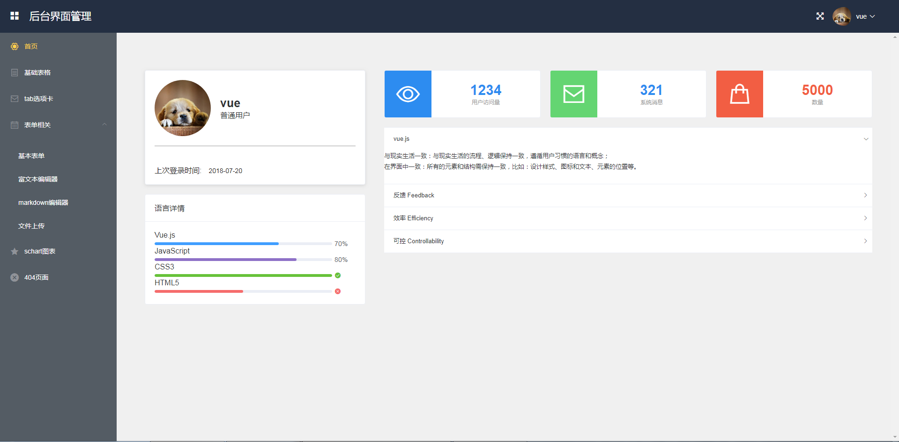

# 基于vue实现一个简单后台管理界面


## vue.js与Element-ui结合搭建一个后台管理界面,利用vue-resource请求数据，数据的来源是野狗云存储，


## 项目结构
```
  |——— build  #webpack编译相关文件目录，一般不需要动
	|——— config  #配置环境变量
	|    |——— dev.env.js #开发环境变量
	|		 |——— index.js   #主配置文件
	|    |——— prod.js    #生产环境变量
	|——— node_modules #一些常用安装的依赖
	|——— src #前端项目源码目录
	|    |——— assets  #资源目录
	|    |——— components   #组件以及页面文件目录
	|         |---common   #公共组件
	|            	|--- Header.vue  #公共头部内容
	|					    |--- Home.vue    #公共路由出口
	|					    |--- Sidebar.vue #公共左边栏
	|		 			|——— page        #相关路由页面
	|						  |--- formcorrelation 表单相关文件目录
	|                  |--- BaseForm.vue   #基本表单
	|                  |--- Markdown.vue   #Markdown
	|                  |--- VueEditor.vue  #富文本编辑器
	|                  |--- Upload.vue     #文件上传
	|             |--- 404.vue             #404页面
	|             |--- BaseCharts.vue      #图表 
	|             |--- BaseTable.vue       #基础表格
	|             |--- Dashboard.vue       #首页      
	|             |--- Login.vue           #登录页面
	|             |--- Tabs.vue            #选项卡
	|    |——— router  #路由目录
	|    |——— App.vue #项目入口文件
	|    |——— main.js #项目核心文件
	|——— static       #开发模式下静态资源目录
	|——— index.html   #首页入口文件，你可以添加一些 meta 信息或同统计代码啥的
	|——— package.json #项目配置文件
	|___ README.md    #项目的说明文档，markdown 格式
```

## 项目编译和运行
    1. 可以直接在git上下载项目源码。把github下载到本地，
	git clone 
	2. 进入到tourism目录，进行初始化，安装依赖
		npm run dev
	3. 依赖安装成功后执行启动命令
	   npm run dev
	   如果显示一下内容说明安装成功
	   I  Your application is running here: http://localhost:8080
		 
## 相关功能
	1. 登录/注销
	2. markdown编辑器
	3. 富文本编辑器
	4. 图表 bar_chart
	5. 表单
	6. Tab选项卡
	7. 表格
	
## 成果展示


#### 后续功能正在完善中......